<!-- ===== THEME-AWARE HERO BANNER ===== -->
<!-- GitHub automatically shows dark.svg in dark mode and light.svg in light mode -->

<picture>
  <source media="(prefers-color-scheme: dark)" srcset="dark.svg">
  <source media="(prefers-color-scheme: light)" srcset="light.svg">
  
</picture>

<!-- ═══ circuit divider ═══ -->
<picture>
  <source media="(prefers-color-scheme: dark)" srcset="divider-dark.svg">
  <source media="(prefers-color-scheme: light)" srcset="divider-light.svg">
  
</picture>

<!-- ===== STREAK STATS ===== -->

<picture>
  <source media="(prefers-color-scheme: dark)" srcset="https://raw.githubusercontent.com/AYASKA-in/AYASKA-in/output/streak-dark.svg" />
  
</picture>

<!-- ═══ circuit divider ═══ -->
<picture>
  <source media="(prefers-color-scheme: dark)" srcset="divider-dark.svg">
  <source media="(prefers-color-scheme: light)" srcset="divider-light.svg">
  
</picture>

<!-- ===== GITHUB STATS ===== -->

<!-- Stats Top Frame -->
<picture>
  <source media="(prefers-color-scheme: dark)" srcset="stats-frame-top-dark.svg">
  <source media="(prefers-color-scheme: light)" srcset="stats-frame-top-light.svg">
  
</picture>

<!-- Stats + Top languages — side by side -->
<picture><source media="(prefers-color-scheme: dark)" srcset="https://github-readme-stats-sigma-rosy-28.vercel.app/api?username=AYASKA-in&show_icons=true&count_private=true&include_all_commits=true&hide_rank=true&hide_border=true&title_color=22D3EE&icon_color=A78BFA&text_color=94A3B8&bg_color=0C1426&card_width=500" /></picture>&nbsp;<picture><source media="(prefers-color-scheme: dark)" srcset="https://github-readme-stats-sigma-rosy-28.vercel.app/api/top-langs/?username=AYASKA-in&layout=compact&langs_count=8&hide_border=true&title_color=22D3EE&text_color=94A3B8&bg_color=0C1426&card_width=500" /></picture>

<!-- Stats Bottom Frame -->
<picture>
  <source media="(prefers-color-scheme: dark)" srcset="stats-frame-bottom-dark.svg">
  <source media="(prefers-color-scheme: light)" srcset="stats-frame-bottom-light.svg">
  
</picture>

<!-- ═══ circuit divider ═══ -->
<picture>
  <source media="(prefers-color-scheme: dark)" srcset="divider-dark.svg">
  <source media="(prefers-color-scheme: light)" srcset="divider-light.svg">
  
</picture>

<!-- ===== SKILLS MATRIX ===== -->

<picture>
  <source media="(prefers-color-scheme: dark)" srcset="skills-dark.svg">
  <source media="(prefers-color-scheme: light)" srcset="skills-light.svg">
  
</picture>

<!-- ═══ circuit divider ═══ -->
<picture>
  <source media="(prefers-color-scheme: dark)" srcset="divider-dark.svg">
  <source media="(prefers-color-scheme: light)" srcset="divider-light.svg">
  
</picture>

<!-- ===== TECH CONSTELLATION ===== -->

<picture>
  <source media="(prefers-color-scheme: dark)" srcset="constellation-dark.svg">
  <source media="(prefers-color-scheme: light)" srcset="constellation-light.svg">
  
</picture>

<!-- ═══ circuit divider ═══ -->
<picture>
  <source media="(prefers-color-scheme: dark)" srcset="divider-dark.svg">
  <source media="(prefers-color-scheme: light)" srcset="divider-light.svg">
  
</picture>

<!-- ===== CONTRIBUTION SNAKE ===== -->

<picture>
  <source media="(prefers-color-scheme: dark)" srcset="https://raw.githubusercontent.com/AYASKA-in/AYASKA-in/output/snake-dark.svg" />
  <source media="(prefers-color-scheme: light)" srcset="https://raw.githubusercontent.com/AYASKA-in/AYASKA-in/output/snake-light.svg" />
  
</picture>

<!-- No circuit divider here for tighter spacing -->

<!-- ===== PROJECTS ===== -->

<!-- ═══ circuit divider ═══ -->
<picture>
  <source media="(prefers-color-scheme: dark)" srcset="divider-dark.svg">
  <source media="(prefers-color-scheme: light)" srcset="divider-light.svg">
  
</picture>

<!-- ===== TYPING TERMINAL QUOTE ===== -->

<picture>
  <source media="(prefers-color-scheme: dark)" srcset="quote-dark.svg">
  <source media="(prefers-color-scheme: light)" srcset="quote-light.svg">
  
</picture>

<!-- ===== SOCIAL LINKS ===== -->

<picture>
  <source media="(prefers-color-scheme: dark)" srcset="social-dark.svg">
  <source media="(prefers-color-scheme: light)" srcset="social-light.svg">
  
</picture>

<!-- =================================== -->
